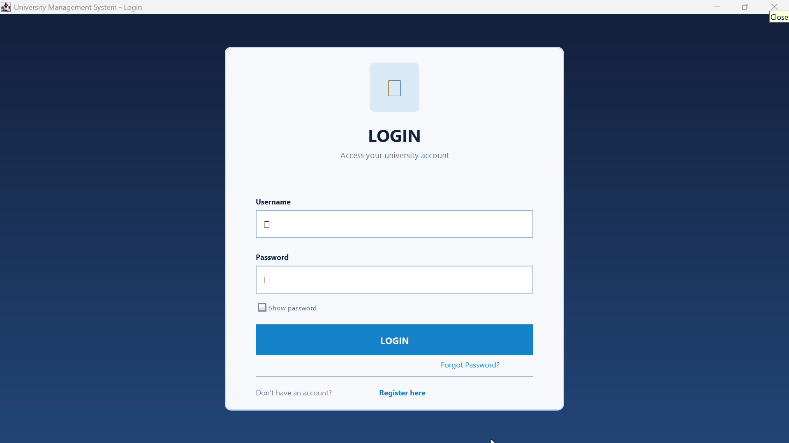
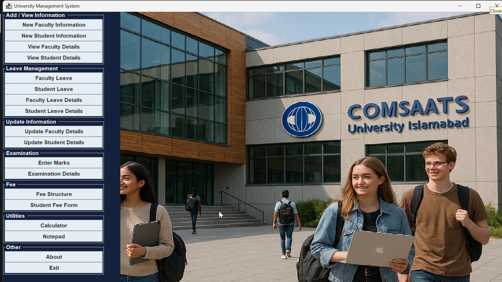
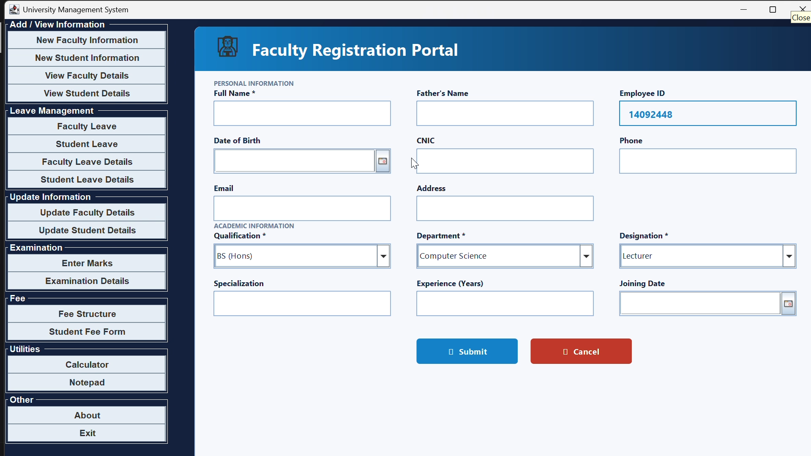
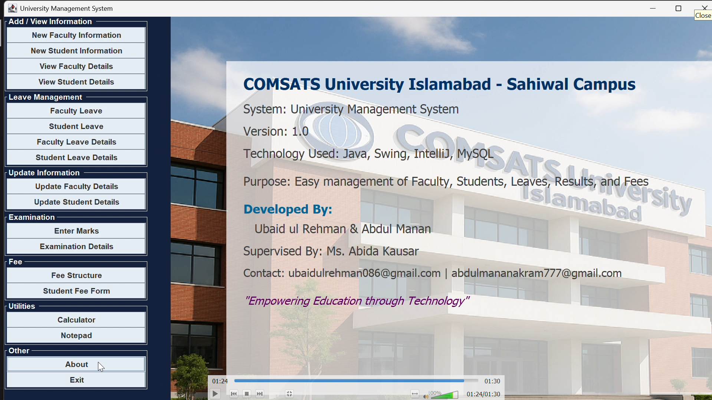
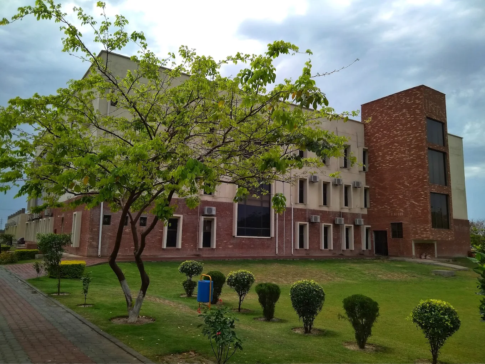

# 🎓 University Management System
### A Desktop Application built with Java Swing | OOP Final Project — 3rd Semester


---

## 📌 Overview

The **University Management System** is a full-featured desktop application developed as a semester project during my **3rd Semester** of university. Built entirely in **Java (Swing)** with a **MySQL** backend, it covers every core administrative need of a modern university — from student and faculty management to fee tracking and examination results.

The UI was designed with a consistent **deep-navy + blue accent** theme across all modules, giving it a professional, modern look while remaining lightweight and fast as a desktop application.

---

## ✨ Features

### 👨‍🎓 Student Module
- Register new students with full personal and academic details
- Update existing student records
- View all student details in a searchable, styled table
- Apply and track student leaves
- View student leave records

### 👨‍🏫 Faculty Module
- Add new faculty members with qualification and designation
- Update faculty details via Employee ID selection
- Browse faculty records with a data table
- Apply and manage faculty leaves
- View leave history

### 💳 Fee Management
- Structured fee display per program and semester
- Student fee payment form with real-time balance calculation
- Tracks total payable, amount paid, and remaining balance

### 📝 Examination & Marks
- Enter subject names and marks per student per semester
- View result cards with Pass / Fail status per subject
- Search and browse examination records

### 🔐 Authentication
- Secure login system
- New user registration
- Forgot password recovery

### 🖥️ Desktop Dashboard
- Modern sidebar navigation
- Role-based access to modules
- Consistent branding throughout

---

## 🛠️ Tech Stack

| Technology | Purpose |
|---|---|
| Java (JDK 8+) | Core application logic |
| Java Swing | GUI / Desktop interface |
| MySQL | Database backend |
| JDBC | Java–Database connectivity |
| JCalendar Library | Date picker components |
| rs2xml Library | ResultSet → JTable binding |

---

## 🗂️ Project Structure

```
university-management-system/
│
├── src/
│   └── university/management/system/
│       ├── Main.java                  # Entry point
│       ├── Desktop.java               # Main dashboard with sidebar
│       ├── Login.java                 # Login screen
│       ├── Register.java              # Registration screen
│       ├── ForgetPassword.java        # Password recovery
│       ├── About.java                 # About page
│       │
│       ├── AddStudent.java            # Add new student
│       ├── updateStudent.java         # Update student record
│       ├── StudentDetails.java        # View all students
│       ├── StudentLeave.java          # Apply student leave
│       ├── StudentLeaveDetails.java   # Student leave records
│       │
│       ├── AddFaculty.java            # Add new faculty
│       ├── UpdateFaculty.java         # Update faculty record
│       ├── FacultyDetails.java        # View all faculty
│       ├── FacultyLeave.java          # Apply faculty leave
│       ├── TeacherLeaveDetails.java   # Faculty leave records
│       │
│       ├── StudentFeeForm.java        # Fee payment form
│       ├── FreeStructure.java         # Fee structure table
│       │
│       ├── EnterMarks.java            # Enter student marks
│       ├── ExaminationDetails.java    # Browse exam records
│       ├── Marks.java                 # Result card viewer
│       │
│       └── Conn.java                  # Database connection helper
│
├── lib/
│   ├── mysql-connector-java.jar
│   ├── jcalendar-1.4.jar
│   └── rs2xml.jar
│
└── README.md
```

---

## 🗄️ Database Setup

1. Open MySQL and create a new database:
```sql
CREATE DATABASE university_management;
USE university_management;
```

2. Create the required tables:
```sql
CREATE TABLE student (
    Enrollment_No VARCHAR(20) PRIMARY KEY,
    Name VARCHAR(100),
    Father_Name VARCHAR(100),
    DOB VARCHAR(20),
    CNIC VARCHAR(20),
    Phone_No VARCHAR(15),
    Email VARCHAR(100),
    Address VARCHAR(200),
    Department VARCHAR(100),
    Program VARCHAR(50),
    Semester VARCHAR(10),
    Gender VARCHAR(10),
    Admission_Date VARCHAR(20)
);

CREATE TABLE teacher (
    Emp_ID VARCHAR(20) PRIMARY KEY,
    Name VARCHAR(100),
    Father_Name VARCHAR(100),
    DOB VARCHAR(20),
    CNIC VARCHAR(20),
    Phone_No VARCHAR(15),
    Email VARCHAR(100),
    Address VARCHAR(200),
    Qualification VARCHAR(50),
    Department VARCHAR(100),
    Designation VARCHAR(50),
    Specialization VARCHAR(100),
    Experience VARCHAR(10),
    Joining_date VARCHAR(20)
);

CREATE TABLE fee (
    program VARCHAR(50),
    Semester1 VARCHAR(10), Semester2 VARCHAR(10),
    Semester3 VARCHAR(10), Semester4 VARCHAR(10),
    Semester5 VARCHAR(10), Semester6 VARCHAR(10),
    Semester7 VARCHAR(10), Semester8 VARCHAR(10)
);

CREATE TABLE feecollege (
    rollno VARCHAR(20),
    course VARCHAR(50),
    department VARCHAR(100),
    semester VARCHAR(20),
    total VARCHAR(10),
    paid_amount VARCHAR(10)
);

CREATE TABLE subject (
    rollno VARCHAR(20),
    semester VARCHAR(20),
    subj1 VARCHAR(50), subj2 VARCHAR(50),
    subj3 VARCHAR(50), subj4 VARCHAR(50),
    subj5 VARCHAR(50)
);

CREATE TABLE marks (
    rollno VARCHAR(20),
    semester VARCHAR(20),
    mrk1 VARCHAR(5), mrk2 VARCHAR(5),
    mrk3 VARCHAR(5), mrk4 VARCHAR(5),
    mrk5 VARCHAR(5)
);

CREATE TABLE studentleave (
    Roll_No VARCHAR(20),
    Leave_date VARCHAR(20),
    Duration VARCHAR(20)
);

CREATE TABLE teacherleave (
    Emp_ID VARCHAR(20),
    Leave_Date VARCHAR(20),
    Duration VARCHAR(20)
);

CREATE TABLE login (
    username VARCHAR(50),
    password VARCHAR(50)
);
```

3. Update `Conn.java` with your MySQL credentials:
```java
connection = DriverManager.getConnection(
    "jdbc:mysql://localhost:3306/university_management",
    "root",       // your username
    "yourpassword" // your password
);
```

---

## 🚀 How to Run

### Prerequisites
- JDK 8 or higher installed
- MySQL Server running
- NetBeans IDE (recommended) or any Java IDE

### Steps

1. **Clone the repository**
```bash
git clone https://github.com/muhammad-ubaid-ul-rehman/University-Management-System-GUI.git
cd University-Management-System-GUI
```

2. **Add library JARs** to your project build path:
   - `mysql-connector-java.jar`
   - `jcalendar-1.4.jar`
   - `rs2xml.jar`

3. **Set up the database** using the SQL script above

4. **Run `Main.java`** — the login screen will appear

5. **Default credentials** (set manually in the login table):
```sql
INSERT INTO login VALUES ('admin', 'admin123');
```

---

## 📸 Screenshots

| Login Screen | Dashboard |
|---|---|
|  |  |

| Student Registration | Examination Result |
|---|---|
|  |  |

| Author Portrait | University |
|---|---|
|  |  |

---

## 🧠 What I Learned

- Designing multi-screen desktop applications with Java Swing
- Connecting Java applications to a relational MySQL database via JDBC
- Applying Object-Oriented Programming principles (Inheritance, Encapsulation, Abstraction)
- UI/UX consistency across large applications using a shared theme system
- Working with complex SQL queries (JOINs, aggregations, prepared statements)
- Managing real-world data flows: registration → fee payment → examination results

---

## 👨‍💻 Author

**Muhammad Ubaid ul Rehman**
BS Computer Science — 3rd Semester
COMSATS University Islamabad Sahiwal Campus

[](https://linkedin.com/in/muhammad-ubaid-ul-rehman)
[](https://github.com/muhammad-ubaid-ul-rehman)

---

## 📄 License

This project is open source and available under the [MIT License](LICENSE).

---

> *"Every expert was once a beginner. This project represents 100+ hours of learning, debugging, and building — one line of code at a time."*
